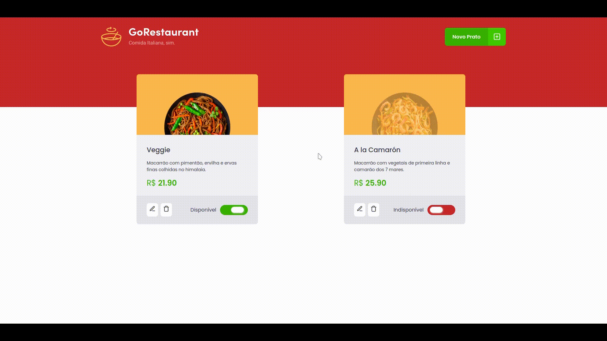
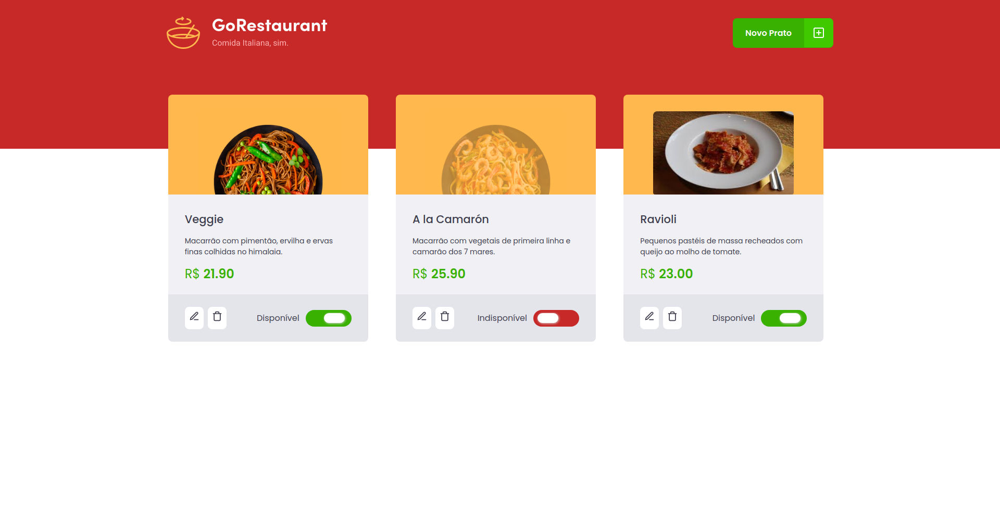
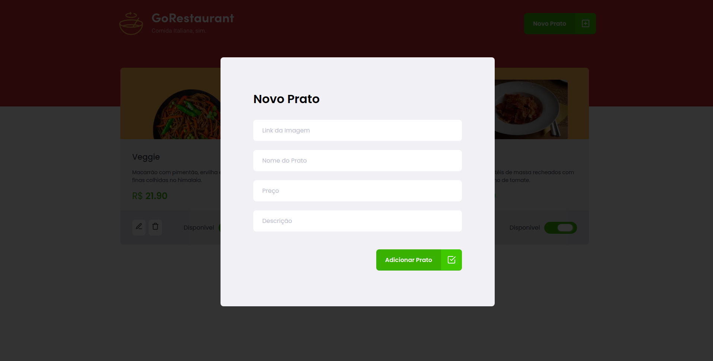

 <h1 align="center">
   GoRestaurant
</h1>

 

## :camera: Demonstração

## :rocket: Tecnologias

Esse projeto foi desenvolvido com as seguintes tecnologias:

✔️Typescript

✔️React

✔️Context API

✔️React-Modal

✔️React-Icons

✔️React-Router-Dom

✔️React Hooks

✔️Styled-components

✔️json-server

✔️Axios

## 💻 Projeto

GoRestaurant é um CRUD que manipula vendas de pratos italianos que são salvos e consumidos em uma Fake REST API.

## ⚙ Configuração

1- Para instalar as dependências:
> yarn

2- Para iniciar a aplicação digite cada comando em 2 terminais paralelos diferentes:
> yarn server
> yarn dev
